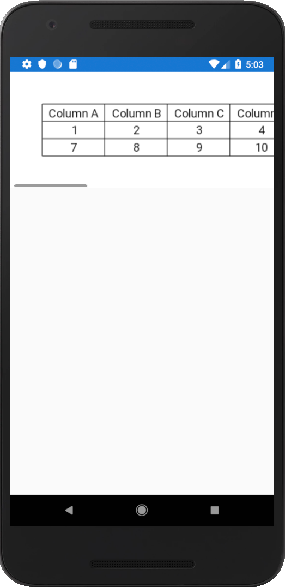

# NoFrillsDataGrid
This is a no-frills data grid control for Xamarin Forms. It uses SkiaSharp as the means to create and draw the data grid itself.

This is still in its early stages. Currently it works for Xamarin Forms and for Xamarin Android. Since it uses SkiaSharp to do the rendering, it can ultimately be ported to any platform that can use SkiaSharp (which is a lot of platforms). I have made the Xamarin Forms package available on Nuget, and I am working on getting the Xamarin Android package on Nuget in the near future. In the meantime, you can simply clone this repository and build the solution if you want to use the Xamarin Android package.

A screenshot and a code example can be found below. Also, there is an example project in the source code.

## Install

Available on NuGet

**Xamarin.Forms (.NET Standard 2.0)**

[](https://www.nuget.org/packages/NoFrills.Xamarin.Forms/)

## Screenshot of example



## Code example (Xamarin Forms, C#)

```csharp

NoFrillsDataGrid g = new NoFrillsDataGrid()
{
    FitCellSizesToLargestText = true,
    DisplayHeaderRow = true,
    Margin = 50,
    BackgroundColor = SKColors.White,
    TableColumnHeaders = new List<string>() { "Column A", "Column B", "Column C", "Column D", "Column E", "Column F" },
    TableCellData = new List<List<object>>()
    {
        new List<object>() { 1, 2, 3, 4, 5, 6 },
        new List<object>() { 7, 8, 9, 10, 11, 12 }
    }
};

g.CalculateExpectedDimensions();

NoFrillsDataGridView gv = new NoFrillsDataGridView()
{
    DataGrid = g,
    WidthRequest = g.CalculatedWidth,
    HeightRequest = g.CalculatedHeight
};

TestScrollView.Content = gv;
            
```
