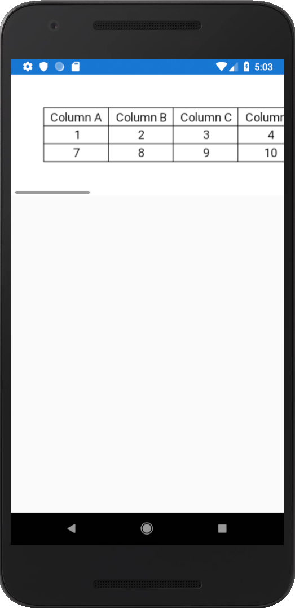

# NoFrillsDataGrid
This is a no-frills data grid control for .NET MAUI. There is also an older package for Xamarin if you still use Xamarin. 

This package uses SkiaSharp as the means to create and draw the data grid itself. Since it uses SkiaSharp to do the rendering, it can ultimately be ported to any platform that can use SkiaSharp (which is a lot of platforms).

A screenshot and a code example can be found below. Also, there is an example project in the source code.

## Install

Available on NuGet

**.NET MAUI**

[](https://www.nuget.org/packages/NoFrills.Xamarin.Forms/)

## Screenshot of example



## Code example

```csharp

NoFrillsDataGrid g = new NoFrillsDataGrid()
{
    FitCellSizesToLargestText = true,
    DisplayHeaderRow = true,
    Margin = 50,
    BackgroundColor = SKColors.White,
    TableColumnHeaders = new List<string>() { "Column A", "Column B", "Column C", "Column D", "Column E", "Column F" },
    TableCellData = new List<List<object>>()
    {
        new List<object>() { 1, 2, 3, 4, 5, 6 },
        new List<object>() { 7, 8, 9, 10, 11, 12 }
    }
};

g.CalculateExpectedDimensions();

NoFrillsDataGridView gv = new NoFrillsDataGridView()
{
    DataGrid = g,
    WidthRequest = g.CalculatedWidth,
    HeightRequest = g.CalculatedHeight
};

TestScrollView.Content = gv;
            
```
