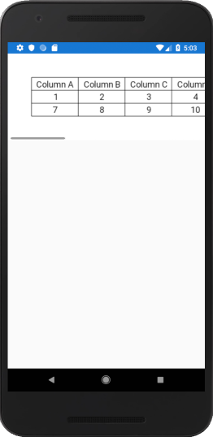

# NoFrillsDataGrid
This is a no-frills data grid control for Xamarin Forms. It uses SkiaSharp as the means to create and draw the data grid itself.

This is still in its early stages, and I have only made a Xamarin Forms version so far. However, since it uses SkiaSharp, porting it to Xamarin.Android and Xamarin.iOS should be extremely simple.

Please see the code for usage details.

## Install

Available on NuGet

**Xamarin.Forms (.NET Standard 2.0)**

## Screenshot of example

## Code example

'''csharp
NoFrillsDataGrid g = new NoFrillsDataGrid()
            {
                FitCellSizesToLargestText = true,
                DisplayHeaderRow = true,
                Margin = 50,
                BackgroundColor = SKColors.White,
                TableColumnHeaders = new List<string>() { "Column A", "Column B", "Column C", "Column D", "Column E", "Column F" },
                TableCellData = new List<List<double>>()
                {
                    new List<double>() { 1, 2, 3, 4, 5, 6 },
                    new List<double>() { 7, 8, 9, 10, 11, 12 }
                }
            };

            g.CalculateExpectedDimensions();

            NoFrillsDataGridView gv = new NoFrillsDataGridView()
            {
                DataGrid = g,
                WidthRequest = g.CalculatedWidth,
                HeightRequest = g.CalculatedHeight
            };

            TestScrollView.Content = gv;
'''
